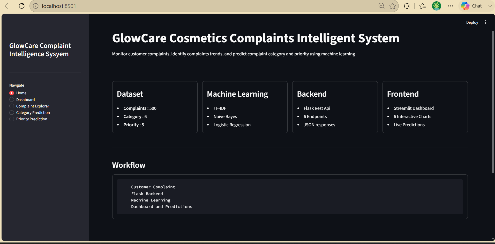
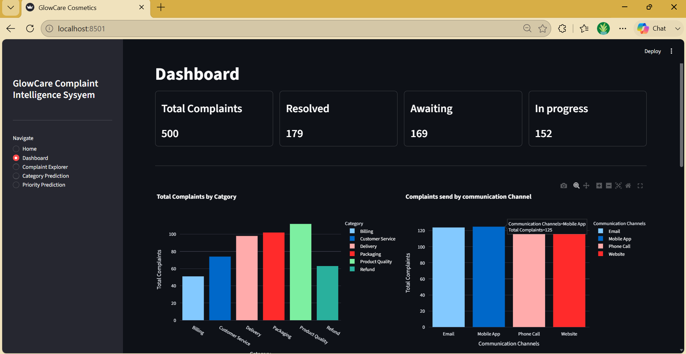
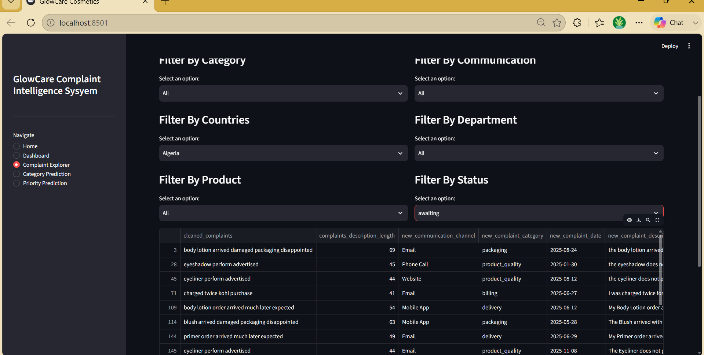
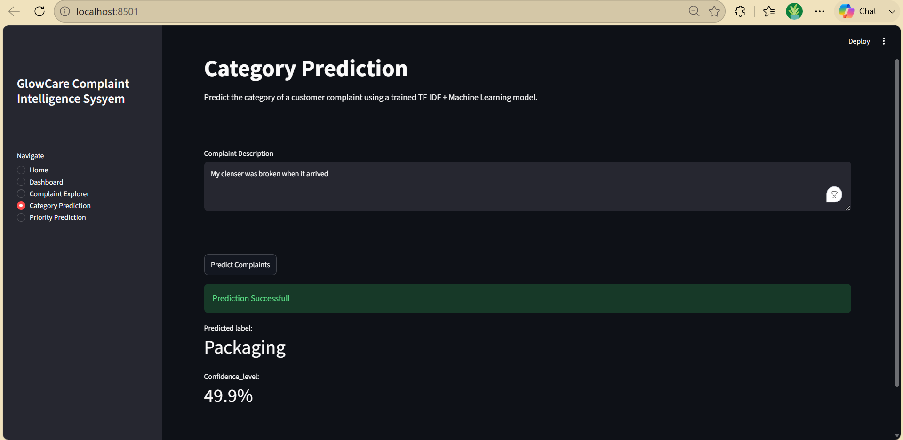
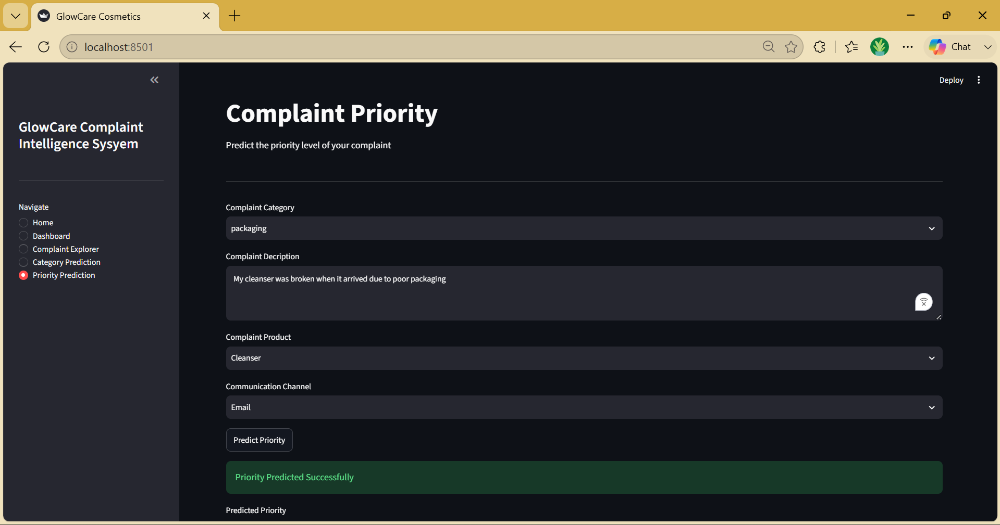

# GlowCare Customer Complaint Intelligence System

An end-to-end Natural Language Processing (NLP) and Machine Learning application that automatically classifies customer complaints, predicts complaint priority, and provides an interactive dashboard for exploring complaint data.

This project combines data analysis, machine learning, REST API development, and dashboard development into a complete full-stack data science application.

---

## Project Overview

GlowCare is a fictional cosmetics company that receives hundreds of customer complaints.

The company currently reviews complaints manually before forwarding them to the appropriate department. This process is slow, repetitive, and difficult to scale.

This project automates part of that workflow by building machine learning models capable of:

- Predicting the complaint category
- Predicting complaint priority
- Exploring complaint trends
- Visualizing complaint statistics

The application consists of a Flask backend that serves machine learning predictions through REST APIs and a Streamlit frontend for visualization and interaction.

---

## Features

### Dashboard

- Complaint KPIs
- Complaint category distribution
- Communication channel analysis
- Customer country analysis
- Department analysis
- Product complaint analysis
- Complaint priority distribution

### Complaint Explorer

- Browse all complaints
- Filter complaints by:
  - Category
  - Country
  - Department
  - Communication Channel
  - Product
  - Complaint Status
- Download filtered results as CSV

### Category Prediction

Predict the category of a complaint using Natural Language Processing.

Models explored:

- Multinomial Naive Bayes
- Logistic Regression
- CountVectorizer
- TF-IDF

### Priority Prediction

Predict the priority level of a complaint using:

- Complaint description
- Complaint category
- Communication channel
- Product type
- Engineered text features

---

## Machine Learning Workflow

The project follows a complete NLP workflow:

- Data Cleaning
- Exploratory Data Analysis
- Text Preprocessing
- Stop Word Removal
- Feature Engineering
- CountVectorizer
- TF-IDF Vectorization
- Model Training
- Model Evaluation
- Model Deployment

---

## Tech Stack

### Programming Language

- Python

### Backend

- Flask
- REST API
- Joblib

### Frontend

- Streamlit
- Plotly

### Machine Learning

- Scikit-learn
- Multinomial Naive Bayes
- Logistic Regression
- CountVectorizer
- TF-IDF

### Data Analysis

- Pandas
- NumPy

### Database

- SQLite

---

## Project Structure

```text
GlowCare-Customer-Complaint-Intelligence-System/

│── backend/
│   ├── app.py
│   ├── models/
│   ├── data/
│
│── frontend/
│   ├── streamlit_app.py
│   ├── api.py
│
│── notebooks/
│
│── screenshots/
│
│── requirements.txt
│── README.md
```

---

## API Endpoints

| Method | Endpoint          | Description                            |
| ------ | ----------------- | -------------------------------------- |
| GET    | `/`               | Welcome message                        |
| GET    | `/get_kpi`        | Returns dashboard KPIs                 |
| GET    | `/analytics`      | Returns analytics for dashboard charts |
| GET    | `/get_complaints` | Returns all complaints                 |
| GET    | `/get_filters`    | Returns filter values                  |
| POST   | `/get_category`   | Predict complaint category             |
| POST   | `/get_priority`   | Predict complaint priority             |

---

## Screenshots

### Home Page



### Dashboard



### Complaint Explorer



### Category Prediction



### Priority Prediction



---

## Running the Project

### Clone the repository

```bash
git clone https://github.com/yourusername/glowcare-customer-complaint-intelligence-system.git
```

### Install dependencies

```bash
pip install -r requirements.txt
```

### Start the Flask backend

```bash
python app.py
```

### Start the Streamlit frontend

```bash
streamlit run streamlit_app.py
```

---

## What I Learned

This project was my first end-to-end NLP application.

During the project I learned how to:

- Build machine learning pipelines for text classification
- Perform text preprocessing using NLTK
- Use CountVectorizer and TF-IDF
- Compare traditional NLP models
- Build REST APIs with Flask
- Connect a Flask backend to a Streamlit frontend
- Build interactive dashboards using Plotly
- Deploy trained machine learning models for inference

One of the biggest lessons from this project was that model performance depends heavily on the quality of the data. While the category prediction model achieved excellent performance, the priority prediction model highlighted how difficult it is for machine learning algorithms to learn meaningful patterns when the target labels contain limited signal.

---

## Future Improvements

- Train using a larger and more realistic dataset
- Improve priority prediction with better-labelled data
- Experiment with transformer-based NLP models such as BERT
- Deploy the application online
- Connect the application to a production database
- Add authentication and user management

---

## License

This project was developed for learning and portfolio purposes.
